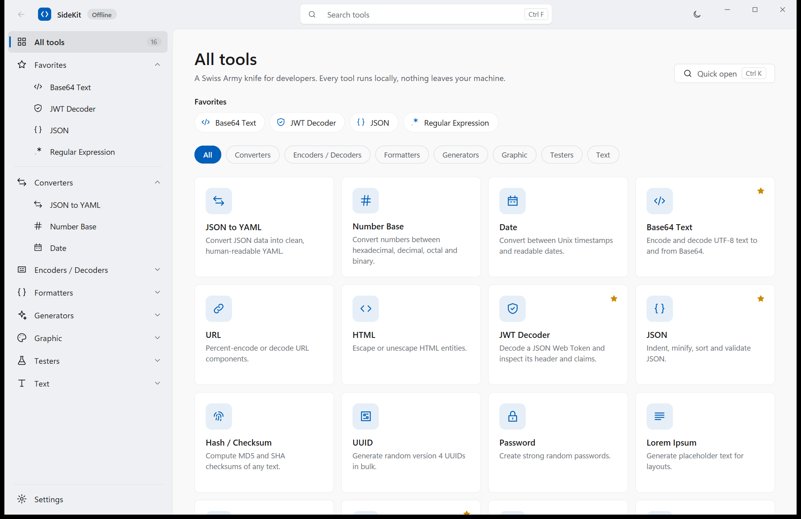
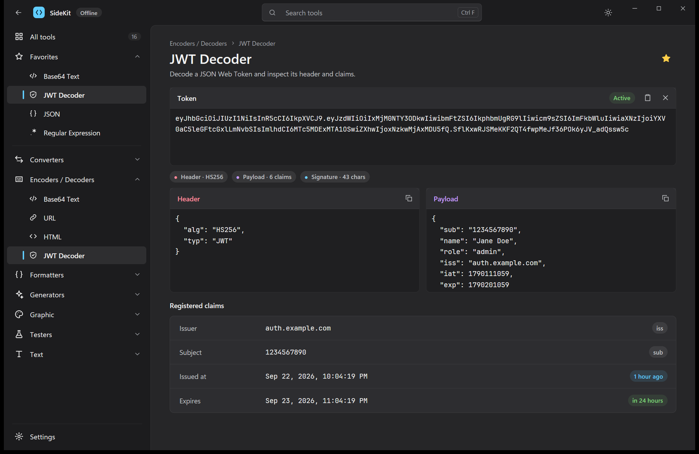

# SideKit

A fast, native developer toolbox built in Rust on [GPUI](https://gpui.rs/) and
[GPUI Kit](https://gpui-kit.com) (gpui-component). Sixteen everyday tools —
formatters, encoders, generators, converters and testers — in one window that
opens in about a quarter of a second and runs entirely offline.





## Install

Prebuilt downloads — no Rust toolchain needed. The installers pick the right
build for your OS and CPU, verify its checksum and put SideKit where your
system expects apps.

**Windows** (PowerShell, no admin rights needed):

```powershell
irm https://raw.githubusercontent.com/pratik-chakravorty/sidekit/master/install.ps1 | iex
```

Installs to `%LOCALAPPDATA%\Programs\SideKit`, adds a Start menu shortcut, puts
`sidekit` on your user `PATH` and registers an entry under
*Settings → Apps → Installed apps* so it can be uninstalled like any other app.

**macOS and Linux** (Terminal):

```sh
curl -fsSL https://raw.githubusercontent.com/pratik-chakravorty/sidekit/master/install.sh | sh
```

- **macOS** (Apple silicon and Intel): installs `SideKit.app` into
  `/Applications` (or `~/Applications`) and links `sidekit` into `~/.local/bin`.
- **Linux** (x86_64 and arm64): installs `sidekit` into `~/.local/bin` plus an
  app-menu entry and icon. SideKit needs a Vulkan driver and the usual desktop
  libraries; the installer lists anything missing. On Debian/Ubuntu:

  ```sh
  sudo apt install libxkbcommon0 libxkbcommon-x11-0 libwayland-client0 libfontconfig1 libvulkan1 mesa-vulkan-drivers
  ```

### Other options

| What                     | Windows (PowerShell)                              | macOS / Linux                                   |
| ------------------------ | ------------------------------------------------- | ----------------------------------------------- |
| Install a given version  | `$env:SIDEKIT_VERSION="v0.1.0"` before the one-liner | `curl … \| sh -s -- --version v0.1.0`          |
| Uninstall                | *Installed apps → SideKit → Uninstall*, or `$env:SIDEKIT_UNINSTALL="1"` then the one-liner | `curl … \| sh -s -- --uninstall`                |
| Install elsewhere        | —                                                  | `curl … \| sh -s -- --prefix /opt/sidekit` (Linux) |
| Skip the PATH change     | `$env:SIDEKIT_NO_PATH="1"`                         | —                                               |

Uninstalling keeps your preferences (`%APPDATA%\SideKit` on Windows,
`~/.config/SideKit` elsewhere).

### Manual download

Grab the file for your platform from the
[latest release](https://github.com/pratik-chakravorty/sidekit/releases/latest):

| Platform                  | File                             |
| ------------------------- | -------------------------------- |
| Windows (x64, runs on ARM too) | `sidekit-windows-x86_64.zip` — unzip and run `sidekit.exe` |
| macOS (universal)         | `sidekit-macos-universal.dmg` — drag SideKit to Applications |
| Linux x86_64              | `sidekit-linux-x86_64.tar.gz`    |
| Linux arm64               | `sidekit-linux-aarch64.tar.gz`   |

The builds are not code-signed yet:

- **macOS**: on first launch of a manually downloaded copy, right-click
  SideKit → *Open* (or run `xattr -dr com.apple.quarantine /Applications/SideKit.app`).
  The install script does this for you.
- **Windows**: SmartScreen may show "Windows protected your PC" for a manually
  downloaded `sidekit.exe`; choose *More info → Run anyway*.

## Build from source

```sh
cargo run --release
```

The optimized binary lands in `target/release/sidekit` (`sidekit.exe` on
Windows) and is self-contained: fonts and icons are embedded.

The toolchain is pinned in `rust-toolchain.toml` (GPUI needs Rust ≥ 1.93).
Platform prerequisites:

- **Windows**: the Windows SDK (for `fxc.exe`, which compiles GPUI's shaders).
- **macOS**: Xcode (for the Metal shader compiler).
- **Linux**: `pkg-config cmake clang libxkbcommon-dev libxkbcommon-x11-dev
  libwayland-dev libx11-xcb-dev libxcb1-dev libfontconfig1-dev libfreetype-dev
  libvulkan-dev` (Debian/Ubuntu names).

## Releasing

Pushing a version tag builds every platform in GitHub Actions
(`.github/workflows/release.yml`) and publishes the files the installers
download:

```sh
git tag v0.1.0
git push origin v0.1.0
```

Keep the tag in step with `version` in `Cargo.toml`. The app icon is generated
by `packaging/make-icons.ps1`.

## Keyboard

| Keys              | Action                               |
| ----------------- | ------------------------------------ |
| `Ctrl K` / `⌘ K`  | Command palette (tools and commands) |
| `Ctrl F`          | Command palette (find text in JSON output when focused) |
| `Alt ←`           | Back                                 |
| `Ctrl Shift T`    | Toggle light / dark                  |
| `Ctrl ,`          | Settings                             |

In the palette: `↑` / `↓` to move, `Enter` to open, `Esc` to close.

## Tools

| Category            | Tools                                              |
| ------------------- | -------------------------------------------------- |
| Converters          | JSON → YAML, Number base, Date ⇄ Unix timestamp (both directions, most date formats) |
| Encoders / Decoders | Base64 text, URL, HTML entities, JWT decoder       |
| Formatters          | JSON (indent, minify, sort, validate, find in output) |
| Generators          | Hash (MD5, SHA-1/256/384/512), UUID v4, Password, Lorem ipsum |
| Graphic             | Color converter with WCAG contrast and shades      |
| Testers             | Regular expression tester with match details       |
| Text                | Text analyzer & case converter, Escape / unescape  |

JSON input and output, YAML output, decoded JWT headers and payloads, and HTML
panes include syntax highlighting that follows the light or dark theme. Text
selection, copying, wrapping, and find-in-output remain available.

Use the expand button in an output pane's header to fill the app below the title
bar. Restore the split view with the shrink button or `Esc`. This is available
for JSON/YAML, encoder/decoder outputs, JWT headers and payloads, regex matches,
and Lorem Ipsum; the current text and editor state are kept when switching views.

## Settings

- **App theme** — light or dark.
- **Editor font size** — 12–15 px for every input and output editor.
- **Wrap long lines** — soft-wrap editors instead of scrolling sideways.
- **Smart detection** — when SideKit starts or regains focus it looks at the
  clipboard; JWTs, JSON, Unix timestamps, colors, Base64 and URL-encoded text
  get an "Open …" suggestion on the home page that loads the clipboard straight
  into the matching tool.
- **Favorites** — star any tool to pin it to the navigation and home page.

Preferences are stored in `%APPDATA%\SideKit\settings.json` on Windows and
`$XDG_CONFIG_HOME/SideKit/settings.json` (or `~/.config/SideKit/`) elsewhere.
Settings from the earlier ToyDev name are picked up automatically.

## Platforms

The title bar is drawn by the app on every platform:

- **Windows** — caption buttons map to native hit-test areas, so Snap Layouts
  and window dragging behave like any Windows app.
- **Linux** — client-side decorations where the compositor allows them, with
  working minimize / maximize / close, drag, double-click to maximize and the
  right-click window menu; server-side decorations are respected otherwise.
- **macOS** — the system traffic lights sit in the title bar and the app
  handles dragging and double-click zoom.

## Project layout

| Path              | What                                                    |
| ----------------- | ------------------------------------------------------- |
| `src/main.rs`     | Window setup, fonts, theme, key bindings                |
| `src/app.rs`      | Shell: title bar, navigation, home, settings, tool page |
| `src/palette.rs`  | Ctrl+K command palette with fuzzy ranking               |
| `src/ui.rs`       | Design components (settings rows, toggles, panes, …)    |
| `src/theme.rs`    | Design tokens and the bridge to gpui-component's theme  |
| `src/logic.rs`    | Pure conversion logic and clipboard detection, tested   |
| `src/tools/`      | One view per tool, created lazily on first open         |

Run the tests with `cargo test`.

## Start-up

Set `SIDEKIT_TRACE=1` to print start-up phases. On the development machine
(RTX 4080 laptop) the first frame lands about 220 ms after launch in a release
build; roughly 170 ms of that is GPUI's own Direct3D device and DirectWrite
initialization, the app itself adds ~50 ms. Tool views are only built when
first opened.
