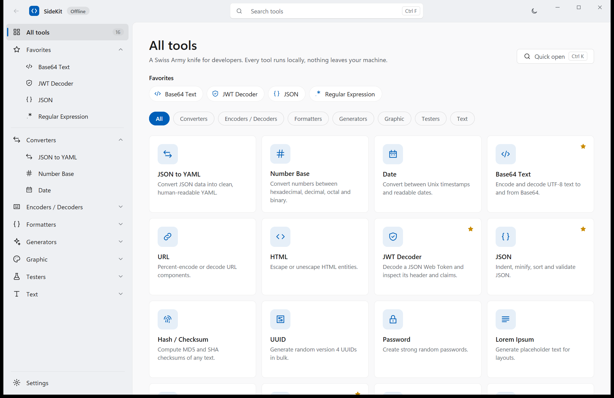
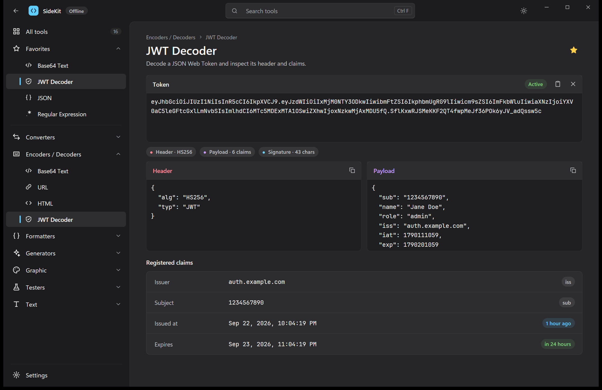

# SideKit

A fast, native developer toolbox built in Rust on [GPUI](https://gpui.rs/) and
[GPUI Kit](https://gpui-kit.com) (gpui-component). Thirty-eight everyday tools —
formatters, encoders, generators, converters and testers — in one window that
opens in about a quarter of a second and runs entirely offline. Chain tools into
reusable workflows, and summon SideKit from any app with a global shortcut.





## Install

Prebuilt downloads — no Rust toolchain needed. The installers pick the right
build for your OS and CPU, verify its checksum and put SideKit where your
system expects apps.

**Windows** (PowerShell, no admin rights needed):

```powershell
irm https://raw.githubusercontent.com/pratik-chakravorty/sidekit/master/install.ps1 | iex
```

Installs to `%LOCALAPPDATA%\Programs\SideKit`, adds a Start menu shortcut, puts
`sidekit` on your user `PATH` and registers an entry under
*Settings → Apps → Installed apps* so it can be uninstalled like any other app.

**macOS and Linux** (Terminal):

```sh
curl -fsSL https://raw.githubusercontent.com/pratik-chakravorty/sidekit/master/install.sh | sh
```

- **macOS** (Apple silicon and Intel): installs `SideKit.app` into
  `/Applications` (or `~/Applications`) and links `sidekit` into `~/.local/bin`.
- **Linux** (x86_64 and arm64): installs `sidekit` into `~/.local/bin` plus an
  app-menu entry and icon. SideKit needs a Vulkan driver and the usual desktop
  libraries; the installer lists anything missing. On Debian/Ubuntu:

  ```sh
  sudo apt install libxkbcommon0 libxkbcommon-x11-0 libwayland-client0 libfontconfig1 libvulkan1 mesa-vulkan-drivers
  ```

### Other options

| What                     | Windows (PowerShell)                              | macOS / Linux                                   |
| ------------------------ | ------------------------------------------------- | ----------------------------------------------- |
| Install a given version  | `$env:SIDEKIT_VERSION="v0.1.0"` before the one-liner | `curl … \| sh -s -- --version v0.1.0`          |
| Uninstall                | *Installed apps → SideKit → Uninstall*, or `$env:SIDEKIT_UNINSTALL="1"` then the one-liner | `curl … \| sh -s -- --uninstall`                |
| Install elsewhere        | —                                                  | `curl … \| sh -s -- --prefix /opt/sidekit` (Linux) |
| Skip the PATH change     | `$env:SIDEKIT_NO_PATH="1"`                         | —                                               |

Uninstalling keeps your preferences (`%APPDATA%\SideKit` on Windows,
`~/.config/SideKit` elsewhere).

### Manual download

Grab the file for your platform from the
[latest release](https://github.com/pratik-chakravorty/sidekit/releases/latest):

| Platform                  | File                             |
| ------------------------- | -------------------------------- |
| Windows (x64, runs on ARM too) | `sidekit-windows-x86_64.zip` — unzip and run `sidekit.exe` |
| macOS (universal)         | `sidekit-macos-universal.dmg` — drag SideKit to Applications |
| Linux x86_64              | `sidekit-linux-x86_64.tar.gz`    |
| Linux arm64               | `sidekit-linux-aarch64.tar.gz`   |

The builds are not code-signed yet:

- **macOS**: on first launch of a manually downloaded copy, right-click
  SideKit → *Open* (or run `xattr -dr com.apple.quarantine /Applications/SideKit.app`).
  The install script does this for you.
- **Windows**: SmartScreen may show "Windows protected your PC" for a manually
  downloaded `sidekit.exe`; choose *More info → Run anyway*.

## Build from source

```sh
cargo run --release
```

The optimized binary lands in `target/release/sidekit` (`sidekit.exe` on
Windows) and is self-contained: fonts and icons are embedded.

The toolchain is pinned in `rust-toolchain.toml` (GPUI needs Rust ≥ 1.93).
Platform prerequisites:

- **Windows**: the Windows SDK (for `fxc.exe`, which compiles GPUI's shaders).
- **macOS**: Xcode (for the Metal shader compiler).
- **Linux**: `pkg-config cmake clang libxkbcommon-dev libxkbcommon-x11-dev
  libwayland-dev libx11-xcb-dev libxcb1-dev libfontconfig1-dev libfreetype-dev
  libvulkan-dev` (Debian/Ubuntu names).

## Releasing

Pushing a version tag builds every platform in GitHub Actions
(`.github/workflows/release.yml`) and publishes the files the installers
download:

```sh
git tag v0.1.0
git push origin v0.1.0
```

Keep the tag in step with `version` in `Cargo.toml`. The app icon is generated
by `packaging/make-icons.ps1`.

## Keyboard

| Keys              | Action                               |
| ----------------- | ------------------------------------ |
| `Ctrl Alt K` / `⌃ ⌥ K` | From any app: bring SideKit forward with the clipboard's tool open (press again to hide) |
| `Ctrl K` / `⌘ K` / `Ctrl P` | Command palette (tools, commands, workflows and the AI library) |
| `Ctrl F`          | Command palette (find text in JSON output when focused) |
| `Alt ←`           | Back (also steps back through library items) |
| `Esc`             | Leave edit mode in the AI library    |
| `Ctrl Shift T`    | Toggle light / dark (Settings also has a System option that follows the OS) |
| `Ctrl ,`          | Settings                             |

In the palette: `↑` / `↓` (or `Ctrl P` / `Ctrl N`) to move, `Enter` to open,
`Esc` to close.

## Workflows

Chain tools so each step's output is the next step's input — for example
*Get query parameter → URL decode → Base64 decode → Format JSON* turns
`token=eyJ1c2Vy…%3D` from a log line into readable JSON.

- **Steps**: Base64 / Base64URL, URL, HTML and hex encode or decode, escape /
  unescape, get query parameter, JWT payload, format / minify / sort JSON,
  JSONPath query, JSON ⇄ YAML, JSON ⇄ TOML, hash (SHA-256, SHA-1, SHA-512,
  MD5, CRC-32), regex extract, trim, upper / lower case, sort lines and remove
  duplicate lines.
- Each step shows its own result as you type. Steps can be switched off to pass
  their input straight through; if one fails, the steps after it are skipped
  and the failing step is named.
- **Save** a workflow once and later edits save themselves. Every saved
  workflow is in the command palette twice: to open it, and to run it on the
  clipboard text.

Workflows are small JSON files under `%APPDATA%\SideKit\workflows` (Windows)
or `~/.config/SideKit/workflows`, one per workflow, so they can be shared or
kept in git.

## SQL Diagram

Paste `CREATE TABLE` statements and get an entity-relationship diagram. The
dialect (MySQL, PostgreSQL, SQLite or Cassandra CQL) is detected from the text.

- **Tables, views and types**: columns show their type and are tagged `PK`,
  `FK`, `UQ` or `IX`. Cassandra tables show partition (`PK`) and clustering
  (`CK`) keys instead. Views link to the tables they read, and columns of a
  user-defined type link to that type.
- **Relationships** come from declared foreign keys. Turn on *Guess missing
  links* to also connect columns such as `orders.user_id` to `users.id`
  (drawn dashed), which helps with Cassandra and schemas that have no
  constraints. Every link is also listed below the diagram.
- **Canvas**: pan, zoom and drag tables around; *Arrange* lays them out again
  and *Fit* brings the whole diagram into view.
- **Copy as Mermaid** puts an `erDiagram` on the clipboard for Markdown docs.
- The parser is forgiving: queries and statements it does not draw are skipped
  and named, never treated as errors.

## AI Library

Keep the skills, prompts, agents and project rules you use with Claude Code,
Codex, Cursor and GitHub Copilot in one searchable place, then put them back
where each tool expects them.

- **Import** by dropping files or folders on the library, picking a folder, or
  scanning the usual places (`~/.claude/skills`, `~/.claude/agents`,
  `~/.claude/commands`, `~/.codex/prompts`, `~/.cursor/rules`, `~/.copilot/skills`,
  …). SideKit recognizes `SKILL.md`, `AGENTS.md`, `CLAUDE.md`, `.cursorrules`,
  Cursor `.mdc` files, Copilot's `copilot-instructions.md`, `*.agent.md`,
  `*.prompt.md` and `*.instructions.md` files, and Markdown under `skills`,
  `agents`, `prompts`, `commands` and `rules` folders. It reads `name`,
  `description`, `tags` and `type` from frontmatter.
- **Duplicates** are matched by content, so the same skill copied into five
  repositories is stored once.
- **Browse** a list grouped into Pinned, Skills, Prompts, Agents and Rules.
  The search box matches names, descriptions and text, and also takes `#tag`
  and kind words (`skill`, `prompts`, …). Pin items to keep them at the top.
- **Edit** in place: each item shows as rendered Markdown; Edit opens the raw
  file, frontmatter included, and changes save as you type.
- **Credentials**: lines that look like keys, tokens or private keys are
  flagged with their line numbers.
- **Install** an item into Claude Code (user or project skills, subagents and
  slash commands, or `CLAUDE.md`), Codex (skills, prompts, global `AGENTS.md`),
  Cursor (`.cursor/rules/*.mdc`, commands), GitHub Copilot (skills and custom
  agents in `~/.copilot` or `.github`, `.github/prompts/*.prompt.md`,
  `.github/copilot-instructions.md`) or a project's `AGENTS.md`. Files are
  never overwritten without asking.

  Installing writes a copy: editing the item in the library later does not
  change copies already installed. Install to the same place again and choose
  **Replace** to update one.
- **Prompt placeholders** such as `{{topic}}` or `$ARGUMENTS` get input fields;
  Copy puts the filled-in prompt on the clipboard.
- **Command palette**: items, and every library action (new, import, scan,
  copy, install, pin, edit, move, delete), are in `Ctrl K`. Actions for the
  item on show are listed first while the library is open.

Everything is plain Markdown under `%APPDATA%\SideKit\library` (Windows) or
`~/.config/SideKit/library`, one folder per kind, so it can be backed up or
kept in git. Set `SIDEKIT_LIBRARY` to use another folder.

## Tools

| Category            | Tools                                              |
| ------------------- | -------------------------------------------------- |
| Converters          | JSON ⇄ YAML, JSON ⇄ TOML, JSON ⇄ CSV, Number base, Date ⇄ Unix timestamp (both directions, most date formats) |
| Encoders / Decoders | Base64 text, Base64 image (data URIs), Hex ⇄ text, URL, URL parser, HTML entities, X.509 certificate decoder, JWT decoder |
| Formatters          | JSON (indent, minify, sort, validate, find in output), SQL, XML (with well-formedness check) |
| Generators          | Hash (MD5, SHA-1/224/256/384/512, CRC-32, HMAC), UUID v4 / v7 and ULID, Password, QR code, Mock data (JSON or CSV), Lorem ipsum |
| Graphic             | Color converter with WCAG contrast and shades, SQL to ER diagram (MySQL, PostgreSQL, SQLite, Cassandra CQL) |
| Network             | IPv4 / IPv6 subnet calculator and address converter, IP range expander & summarizer, MAC address generator, IPv6 ULA generator |
| Testers             | Regular expression tester, Cron expression parser (plain English + next runs), JSONPath playground, Structured data diff (JSON / YAML) |
| Text                | Text analyzer & case converter, Escape / unescape, Text diff, Markdown preview, Line sort & dedupe, Unicode inspector |

JSON, YAML, TOML, SQL, XML and Markdown panes, decoded JWT headers and payloads, and HTML
panes include syntax highlighting that follows the light or dark theme. Text
selection, copying, wrapping, and find-in-output remain available.

Use the expand button in an output pane's header to fill the app below the title
bar. Restore the split view with the shrink button or `Esc`. This is available
for JSON/YAML, encoder/decoder outputs, JWT headers and payloads, regex matches,
and Lorem Ipsum; the current text and editor state are kept when switching views.

## Settings

- **App theme** — light, dark, or System to follow the OS.
- **Editor font size** — 12–15 px for every input and output editor.
- **Wrap long lines** — soft-wrap editors instead of scrolling sideways.
- **Smart detection** — when SideKit starts or regains focus it looks at the
  clipboard; JWTs, JSON, Unix timestamps, colors, Base64 and URL-encoded text
  get an "Open …" suggestion on the home page that loads the clipboard straight
  into the matching tool.
- **Favorites** — star any tool to pin it to the navigation and home page.
- **Global shortcut** — `Ctrl Alt K` (`⌃ ⌥ K` on macOS) opens SideKit from any
  app with the clipboard loaded into the matching tool, or the command palette
  when nothing matches. On Linux this works under X11 only; Wayland has no
  global shortcut API for it.
- **Keep running in the tray** (Windows and macOS) — closing the window leaves
  SideKit in the system tray / menu bar so the shortcut keeps working. Click
  the icon to reopen it, or use its menu to quit.

Preferences are stored in `%APPDATA%\SideKit\settings.json` on Windows and
`$XDG_CONFIG_HOME/SideKit/settings.json` (or `~/.config/SideKit/`) elsewhere.
Settings from the earlier ToyDev name are picked up automatically.

## Project layout

| Path              | What                                                    |
| ----------------- | ------------------------------------------------------- |
| `src/main.rs`     | Window setup, fonts, theme, key bindings                |
| `src/app.rs`      | Shell: title bar, navigation, home, settings, tool page |
| `src/registry.rs` | Catalogue of categories and tools                       |
| `src/palette.rs`  | Ctrl+K command palette with fuzzy ranking               |
| `src/settings.rs` | Preferences and where they are stored                   |
| `src/hotkey.rs`   | System-wide shortcut                                    |
| `src/tray.rs`     | Tray (Windows) / menu bar (macOS) icon                  |
| `src/ui.rs`       | Design components (settings rows, toggles, panes, …)    |
| `src/theme.rs`    | Design tokens and the bridge to gpui-component's theme  |
| `src/logic.rs`    | Pure conversion logic and clipboard detection, tested   |
| `src/logic/`      | Larger pure modules (CSV, cron, diff, XML, certificates, IP ranges, images / QR, mock data, SQL diagrams, workflow steps), tested |
| `src/library.rs`  | AI library storage, import, credential scan, install targets, tested |
| `src/library_view.rs` | AI library page                                     |
| `src/workflows.rs` | Saved workflow files                                   |
| `src/workflow_view.rs` | Workflows page                                     |
| `src/tools/`      | One view per tool, created lazily on first open         |

Run the tests with `cargo test`.

## Start-up

Set `SIDEKIT_TRACE=1` to print start-up phases. On the development machine
(RTX 4080 laptop) the first frame lands about 220 ms after launch in a release
build; roughly 170 ms of that is GPUI's own Direct3D device and DirectWrite
initialization, the app itself adds ~50 ms. Tool views are only built when
first opened.
